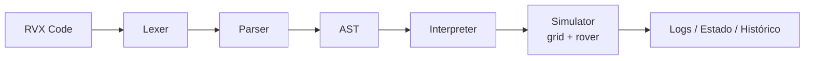

# Arquitetura — RoverX

Este documento descreve a arquitetura do RoverX: camadas, fluxo de execução, responsabilidades de módulos, contratos entre componentes e diretrizes de extensão.

---

## Visão Geral

O RoverX é um simulador de robô programável com uma linguagem própria (RVX). O sistema é composto por:

- **Frontend web** (React + Next.js) para edição, execução e visualização.
- **Pipeline de compilação/execução:** Lexer → Parser → AST → Interpreter.
- **Simulador em grade** (grid + rover) com obstáculos e histórico.
- **CLI** para execução em terminal.

### Estrutura de diretórios

```text
docs/          documentação da linguagem e arquitetura
examples/      exemplos de programas RVX
src/app/       frontend e interface visual
src/core/      compilador e interpretador (lexer, parser, AST, interpreter, environment, types)
src/simulator/ lógica do rover e da grade (grid, rover)
src/cli/       execução via terminal
```

---

## Fluxo de Execução

```text
Código RVX (texto)
    ↓
Lexer  →  tokens tipados
    ↓
Parser  →  AST
    ↓
Interpreter  →  ações semânticas
    ↓
Simulator (grid + rover)  →  estado, colisões, histórico
    ↓
Resultado (logs, estado final, histórico)
```



---

## Módulos do Núcleo (`src/core`)

### `lexer.ts`

- Análise léxica: leitura de caracteres, identificação de identificadores, números, strings e símbolos.
- Emite uma sequência de tokens tipados (`TokenType`) para o parser.
- Erros lançados com posição (linha/coluna) para diagnóstico.

### `parser.ts`

- Constrói a AST a partir dos tokens.
- Valida gramática e detecta erros sintáticos com contexto.
- Produz nós bem formados definidos em `ast.ts`.

### `ast.ts`

- Define os nós da árvore sintática abstrata.
- Principais nós:
  - `Program`, `Identifier`
  - `LetStatement`, `AssignStatement`
  - `MoveStatement`, `TurnStatement`, `FaceStatement`
  - `PlaceObstacleStatement`, `ClearObstacleStatement`
  - `IfStatement`, `RepeatStatement`, `BlockStatement`
  - `IntegerLiteral`, `StringLiteral`

### `environment.ts`

- Armazena variáveis (números, strings e temporários) usando `Map`.
- Fornece operações `get`/`set` e escopo conforme necessário por condicionais/loops.

### `interpreter.ts`

- Percorre a AST e executa a semântica da linguagem.
- Lida com: atribuições, expressões, loops, condicionais, manipulação de obstáculos, comandos de movimento/rotação.
- Comunica-se com o simulador via interface de comandos: `move(n)`, `turn(dir)`, `placeObstacle(x, y)`.
- Produz logs estruturados (etapas, avisos, erros) e coleta histórico de ações.

### `types.ts`

- Define `TokenType`, `Token` e tipos base usados por lexer, parser e AST.

---

## Simulador (`src/simulator`)

### `grid.ts`

- Define o plano cartesiano discreto (largura/altura, limites, validação de coordenadas).
- Mantém e expõe a estrutura de obstáculos.
- API principal: `isInside(x, y)`, `isObstacle(x, y)`, `addObstacle(x, y)`, `removeObstacle(x, y)`.

### `rover.ts`

- Estado do rover: posição `(x, y)`, direção cardinal (`N`, `E`, `S`, `W`), histórico.
- Opera movimentos atômicos e verificação de colisões/limites.
- API principal: `getState()`, `turnLeft()`, `turnRight()`, `moveForward(steps)`, `setPosition(x, y)`, `setDirection(dir)`.
- Interage com `grid` para validar movimentos e registrar histórico de execução (posições, colisões, eventos).

### Contrato entre Interpreter e Simulator

| Direção | Descrição |
| --- | --- |
| Interpreter → Simulator | Invoca métodos do rover e do grid |
| Simulator → Interpreter | Retorna sucesso/falha e eventos consumidos pelo logger |

---

## Frontend (`src/app`)

### `page.tsx`

- Orquestra o estado global: conteúdo do editor, execução de programas, animação do rover, logs, obstáculos e histórico.
- Controla o ciclo: **usuário executa → chama API → recebe resultado → atualiza simulador e console**.

### `route.ts` (API)

- Recebe `POST` com o código RVX.
- Instancia Lexer/Parser → gera AST → executa Interpreter.
- Retorna JSON estruturado:

```json
{ "ok": true, "logs": [], "finalState": {}, "history": [], "obstacles": [] }
```

- Faz validação de payload, tratamento de erros e sincronização do simulador.

### Componentes

| Componente | Responsabilidade |
| --- | --- |
| `ActivityBar.tsx` | Barra lateral estilo VSCode (atalhos/views) |
| `Editor.tsx` | Editor com numeração de linhas, TAB e botão de execução |
| `Header.tsx` | Barra superior (tema, ações globais) |
| `Sidebar.tsx` | Explorador de arquivos RVX (renomear, excluir, menu contextual) |
| `Console.tsx` | Exibe logs do interpretador e mensagens de erro |
| `Simulator.tsx` | Renderização do grid, rover, obstáculos e trilha do histórico |

---

## CLI (`src/cli/run.ts`)

- Lê arquivo `.rvx`, executa `lexer → parser → interpreter`.
- Imprime logs e resultado no console.
- Ideal para testes, CI e execução headless.

---

## Logs e Erros

| Camada | Tipo de erro |
| --- | --- |
| Lexer/Parser | Posição (linha/coluna) + token esperado/encontrado |
| Interpreter | Semântico: variável não definida, tipo inválido, operação proibida |
| Simulator | Colisão, saída do grid, obstáculo detectado |
| `route.ts` | Padroniza resposta JSON com `ok`, `logs[]`, `finalState`, `history[]`, `obstacles[]` |

---

## Persistência e Estado

- O estado do programa **não persiste** entre execuções.
- Arquivos RVX no frontend são mantidos no estado da aplicação (local storage) ou backend conforme implementação.
- O `environment` é reconstruído a cada execução.

---

## Temas e Estilo

| Arquivo | Propósito |
| --- | --- |
| `styles.ts` | Componentes base com Styled Components |
| `themes.ts` | Temas light/dark |
| `styled.d.ts` | Tipagem para segurança de tema em TypeScript |

> TailwindCSS pode coexistir com Styled Components para utilitários rápidos.

---

## Decisões de Design

- **AST explícita** para facilitar extensões (novos statements/expressões).
- **Separação clara de concerns:** análise (lexer/parser) vs. execução (interpreter) vs. simulação (grid/rover).
- **Comunicação por interfaces simples** (comandos síncronos) entre interpreter e simulador.
- **Logs estruturados** desde o interpreter para uniformizar frontend, CLI e testes.

---

## Extensibilidade

| O que adicionar | Como fazer |
| --- | --- |
| Novos comandos | Adicionar `TokenType`, adaptar lexer/parser, criar nó na AST, implementar no interpreter/simulador |
| Novas expressões | Expandir AST e parser; avaliar tipos no interpreter |
| Sensores/condições | Expor API no simulador (ex.: `frontIsClear()`) e mapear para condicionais RVX |
| Múltiplos rovers | Encapsular estado em instâncias; adaptar `page.tsx` e `Simulator.tsx` |

---

## Testes

- **Unitários:** lexer (tokens), parser (árvores), interpreter (semântica), rover/grid (limites/colisões).
- **Integração:** pipeline completo com exemplos em `examples/`.
- **Snapshot:** AST e logs para garantir estabilidade da linguagem.
